# macOS Dotfiles

A macOS development environment with zsh, neovim, wezterm, and powerlevel10k.

## Prerequisites

Install required tools:

```bash
# Install Homebrew
/bin/bash -c "$(curl -fsSL https://raw.githubusercontent.com/Homebrew/install/HEAD/install.sh)"

# Install core tools
brew install stow neovim wezterm zoxide eza fd

# Install Oh My Zsh
sh -c "$(curl -fsSL https://raw.github.com/ohmyzsh/ohmyzsh/master/tools/install.sh)"

# Install Zsh plugins
brew install zsh-autosuggestions zsh-syntax-highlighting powerlevel10k
```

## Install

```bash
git clone git@github.com:r3morce/dotfiles-macos.git ~/.dotfiles-macos
cd ~/.dotfiles-macos

# Check for existing configuration files
./check-conflicts.sh

# Install dotfiles
stow zsh nvim wezterm p10k
```

### Handling Existing Files

If you have existing configuration files, stow will refuse to overwrite them. You have two options:

**Option 1: Remove existing files**
```bash
rm ~/.zshrc ~/.p10k.zsh
rm -rf ~/.config/nvim ~/.config/wezterm
stow zsh nvim wezterm p10k
```

**Option 2: Backup existing files**
```bash
stow --adopt zsh nvim wezterm p10k
```

## What's Included

- **zsh** - Shell configuration with aliases and functions
- **nvim** - LazyVim configuration
- **wezterm** - Terminal with Dracula theme and key bindings
- **p10k** - Powerlevel10k prompt configuration

## Architecture

```mermaid
---
config:
  theme: 'dracula'
---
graph TB
    subgraph "macOS Dotfile Folder"
        A[📁 dotfiles-macos/]
        B[📁 zsh/]
        C[📁 nvim/]
        D[📁 wezterm/]
        E[📁 p10k/]
    end
    
    subgraph "Configuration Files/Folder"
        B1[📄 .zshrc]
        C1[📁 .config/nvim/]
        D1[📁 .config/wezterm/]
        E1[📄 .p10k.zsh]
    end
    
    subgraph "Home Directory"
        F[📄 ~/.zshrc]
        G[📁 ~/.config/nvim/]
        H[📁 ~/.config/wezterm/]
        I[📄 ~/.p10k.zsh]
    end
    
    A --> B
    A --> C
    A --> D
    A --> E
    
    B --> B1
    C --> C1
    D --> D1
    E --> E1
    
    B1 -.->|stow symlink| F
    C1 -.->|stow symlink| G
    D1 -.->|stow symlink| H
    E1 -.->|stow symlink| I
    
    classDef greenBorder stroke:#50fa7b,stroke-width:2px
    classDef purpleBorder stroke:#bd93f9,stroke-width:2px
    classDef orangeBorder stroke:#ffb86c,stroke-width:2px
    
    class F,G,H,I greenBorder
    class B1,C1,D1,E1 purpleBorder
    class A orangeBorder
```

